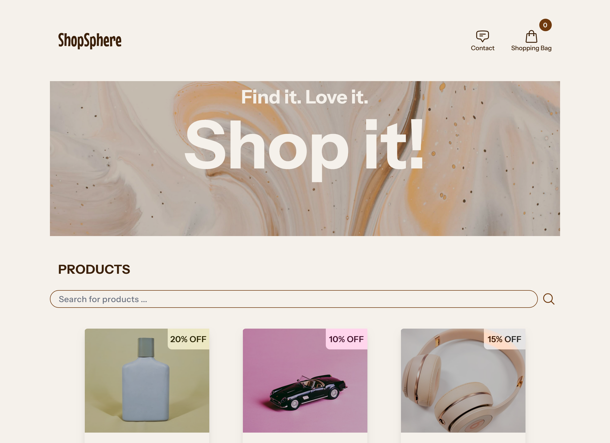

# E-commerce store



## Project Description

This project is an e-commerce store built using Vite, React, and Tailwind CSS. It is a single-page application that features a product listing, individual product pages, a shopping cart system, an auto-fill search bar, and a contact form. The store interacts with the Noroff Online Shop API to display real-time product data, enabling users to browse and search for items. Users can add products to their shopping cart and proceed to the checkout page. The contact form includes form validation, and the submitted data is logged in the console. The application is fully responsive, featuring client-side routing and a cart functionality.

### Pages

- Homepage
- Individual Product Page
- Checkout Page
- Checkout Success Page
- Contact Page

### Features

- List products fetched from API
- Product details on individual items
- Discount display
- Reviewlist
- Product search bar with auto-completion
- Shopping bag functionality
- Form validation on contact form

## Tech Stack

**Client:**

- [React](https://react.dev/reference/react)
- [Vite](https://v2.vitejs.dev/guide/)
- [Tailwind CSS](https://tailwindcss.com/docs/installation)
- [React Router](https://reactrouter.com/en/main)
- [React Hook Form](https://react-hook-form.com/get-started)
- [Eslint](https://eslint.org/docs/latest/)

**Server:**

- [Noroff Online Shop API](https://v2.api.noroff.dev/online-shop)

## Getting Started

### Prerequisites

- [Git](https://git-scm.com/downloads)
- [Node JS](https://nodejs.org/en/download)
- [VS-code](https://code.visualstudio.com/download) or other code editor

## Run Locally

1. Clone repo and open in code editor

```bash
  git clone https://github.com/Sirvau/JS-Frameworks-E-commerce-Store.git
```

2. Install dev-dependencies and other dependencies

```bash
npm install --save-dev
```

```bash
  npm install
```

3. Run application

```bash
  npm run dev
```

4. Build and deploy

```bash
  npm run build
```

## Deployment

[Your Shopsphere](https://your-shopsphere.netlify.app/)
[](https://app.netlify.com/sites/your-shopsphere/deploys)

## Author

- [@Sirvau](https://github.com/Sirvau)
